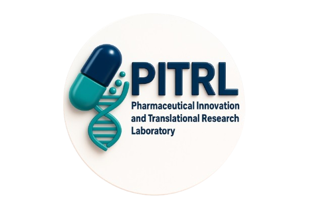
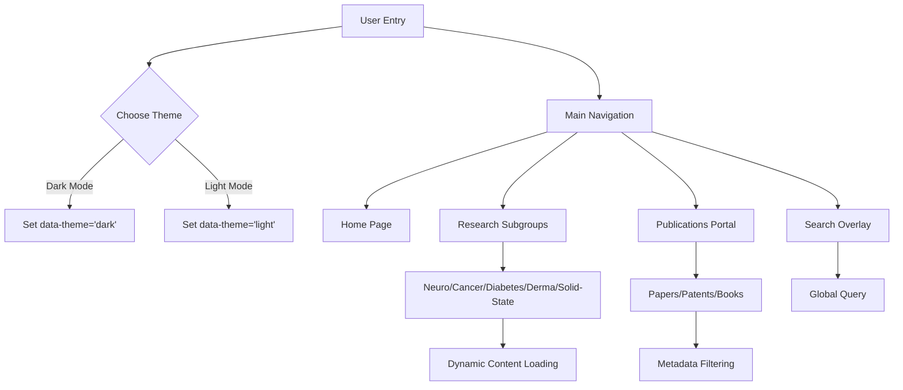

# 🔬 PITRL: Pharmaceutical Innovation & Translational Research Laboratory

## ⭐ Introduction
The Pharmaceutical Innovation & Translational Research Laboratory (PITRL), located within the Department of Pharmaceutics at NIPER Hyderabad, is a premier research facility focused on advancing next-generation therapeutic strategies. The laboratory specializes in translational research, nanomedicine, and novel drug delivery systems (NDDS) aimed at the prevention and management of complex diseases. This website serves as the digital gateway to the lab's research outputs, team profiles, and academic contributions.

---

## 🔗 Live Demo and Visuals
- **Live Link:** [https://anushree-sikder.github.io/NIPER-Hyderabad-PITRL/](https://anushree-sikder.github.io/NIPER-Hyderabad-PITRL/)
  
  

---

## ⭐ Features
| Feature | Description |
| :--- | :--- |
| **Responsive Design** | Fluid layouts optimized for desktop, tablet, and mobile devices. |
| **Theme Engine** | System-aware Dark and Light mode toggle with persistent local storage. |
| **Dynamic Filtering** | Real-time injection of publications and patents based on research areas. |
| **Interactive UI** | Scroll-triggered animations, 3D research cards, and "halo" portrait effects. |
| **Stats Counter** | Automated count-up animation for lab achievements and publications. |
| **Global Search** | Overlay-based search functionality across all sub-pages. |

---

## 👩🏻‍💻 Tech Stack
| Layer | Technologies |
| :--- | :--- |
| **Frontend Core** | HTML5, Vanilla CSS3 (Custom Design System), Vanilla JavaScript (ES6+) |
| **Typography** | Playfair Display (Headings), Belleza (Body Text) |
| **Data Processing** | JSON-based Publication Repositories |
| **Automation Scripts** | Python (Metadata extraction, PDF parsing, Pub-count automation) |
| **Version Control** | Git, GitHub |

---

## 🌐 Pages and Subpages
| Main Page | Category | Subpages / Sections |
| :--- | :--- | :--- |
| **Home** | Overview | Hero Section, PI Profile, Research Cards, News Feed |
| **About** | Background | Mission, Vision, Lab Philosophy |
| **Research** | Scientific Areas | Neuro, Cancer, Diabetes, Derma, Solid-State |
| **Team** | Members | Principal Investigator, Current Members, Alumni |
| **Publications** | Academic Work | Research Papers, Patents, Book & Chapters |
| **Resources** | Facilities | Lab Facilities, Community, News & Updates |
| **Contact** | Communication | Inquiry Form, Location Map, Research Profiles |

---

## ✨ Use Cases
| User Segment | Primary Use Case |
| :--- | :--- |
| **Researchers** | Accessing detailed publications and patent certificates. |
| **Prospective Students** | Exploring lab facilities and current research focus areas. |
| **Academic Partners** | Identifying collaboration opportunities and PI expertise. |
| **Alumni** | Staying updated with lab news and member transitions. |

---

## ⭐ Website Workflow


---

## 👉🏻 Getting Started

### 🔹 Prerequisites
- A modern web browser (Chrome, Firefox, Safari, or Edge).
- (Optional) Python 3.x if you intend to run the data automation scripts.

### 🔹 Local Installation
1. **Clone the repository:**
   ```bash
   git clone https://github.com/your-username/NIPER-PITRL.git
   ```
2. **Access the Project:**
   ```bash
   cd NIPER-PITRL
   ```
3. **Execution:**
   - Open `index.html` directly in your browser.
   - For the best experience, use a local server like `npx serve .` or VS Code Live Server.

---

## ✨ Usage
1. **Navigation:** Use the sticky header to access various research and team sections.
2. **Theme Toggle:** Click the sun/moon icon in the top right to switch visual modes.
3. **Research Exploration:** Navigate to the "Research" dropdown to see specific subgroup advancements.
4. **Publications:** Access the "Publications" menu to view categorized papers and downloadable patent certificates.

---

## 📝 Resources
| Resource Type | Source / Detail |
| :--- | :--- |
| **Fonts** | Google Fonts (Playfair Display, Belleza) |
| **Icons** | Custom Inline SVGs & Material Icons |
| **Styles** | `css/style.css`, `css/research.css` |
| **Logic** | `js/script.js`, `js/research.js` |
| **Data** | `publications/papers.json` (Internal Metadata) |

---

## 🤝 Contributing
Professional collaboration is welcome:
1. Fork the repository.
2. Create a specific feature branch (`git checkout -b feature/ScientificUpdate`).
3. Commit technical changes with clear documentation.
4. Submit a Pull Request for internal review by the lab admins.

---

## Author
**Anushree Kajal Sikder**
